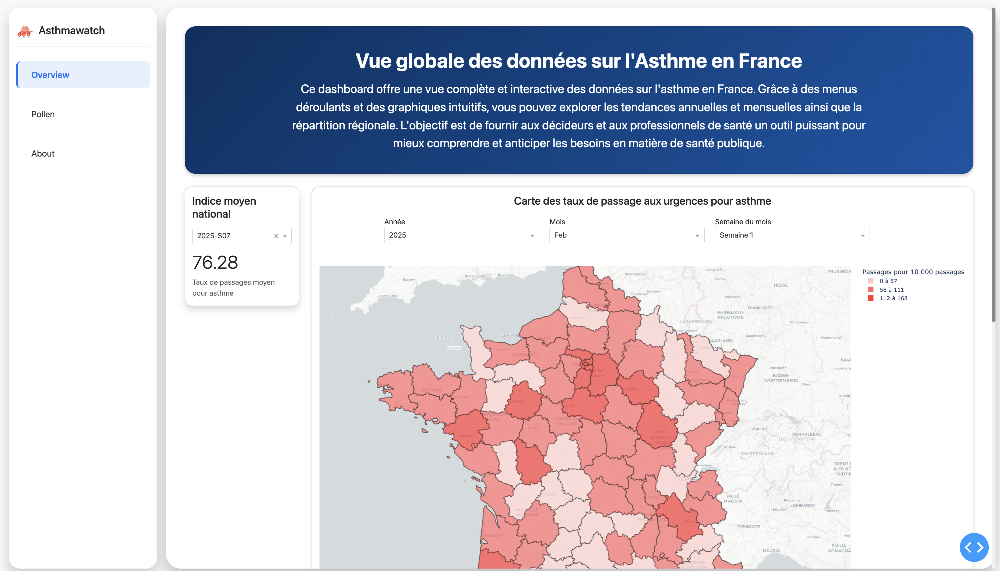

# 🌍 Asthme Dashboard - Urgences, Pollens & Pollution

Un tableau de bord interactif développé avec **Dash** pour visualiser les concentration de différents pollens et des polluants ainsi que les taux de passages aux urgences pour asthme en France.  
Le tableau de bord est mis à jour automatiquement grâce à un pipeline de données intégrant **web scraping, stockage et affichage interactif**.

---

## 🌐 Accès en ligne

Vous pouvez accéder à la version live du dashboard via ce lien :  
[Asthme Dashboard Live](https://sijkhavkmx.eu-west-3.awsapprunner.com/)


## 🖼️ Aperçu du Dashboard



Le tableau de bord fournit :
- **Carte interactive** du taux de passages aux urgences pour asthme par département et sur le niveau de pollen en France.
- **Visualisation des tendances** des urgences, pollens et pollution.
- **Filtres dynamiques** pour explorer les données par période et localisation.

---

## 🔗 Sources des données

- Géodes - Santé Publique France.
- Réseau National de Surveillance Aérobiologique (RNSA).
- GeodAir - Données sur la pollution atmosphérique.

---

## 🛠️ Architecture et Flux des Données

L’architecture est composée de plusieurs blocs fonctionnels :

### ⓵ Extraction des données (Scraping)
- Récupération des données depuis **Géodes, Pollen, Geodair**  
- Utilisation de **Selenium et BeautifulSoup**  
- Automatisation via des **scripts Python**  

### ⓶ Stockage et traitement
- Structuration des données en fichiers **csv* et **xlsx**
- Nettoyage et prétraitement des données
- Enregistrement dans une **base de données locale**

### ⓷ Visualisation et interaction
- **Dashboard construit avec Dash**
- **Cartes et graphiques interactifs**
- **Filtres dynamiques** par période et localisation

### ⓸ Déploiement et automatisation
- **Docker** pour l’environnement d’exécution  
- **Déploiement** sur un serveur avec **Gunicorn**  
- Automatisation via **GitLab CI/CD**  

---

## 🔄 Flux des Données

### ⓵ Récupération des données  
**Sources des données :**  
- **Géodes Santé Publique France** → Taux des passages aux urgences pour asthme  
- **Données polliniques** → Concentration de pollens par ville  
- **Données de pollution (Geodair)** → Suivi des niveaux de pollution atmosphérique  

**Outils utilisés :**  
- **Selenium** → Extraction des données dynamiques  
- **BeautifulSoup** → Analyse et structuration des données HTML  
- **Pandas** → Manipulation et nettoyage des données  

### ⓶ Stockage et traitement  
- Les données brutes sont enregistrées dans **data/raw/**  
- Un script de traitement (**data_loader.py**) nettoie et formate les données  
- Les données structurées sont stockées dans **data/processed/** sous format **CSV**  

### ⓷ Affichage et Analyse  
- **Dash (Plotly)** Génère les visualisations interactives  
- **Carte interactive** : Par exemple la carte sur les taux de passages aux urgences pour asthme par département  
- **Graphiques temporels** : Évolution des tendances sur plusieurs semaines  
- **Filtres dynamiques** : Sélection par date et zone géographique  

### ⓸ Déploiement et Automatisation  
- **Docker** pour containeriser l’application  
- **Gunicorn** pour exécuter l’application sur un serveur  
- **GitLab CI/CD** pour un déploiement automatique  

---

## 🖼️ Schéma d’Architecture  

```
┌──────────────────────────┐
 1️⃣ Web Scraping
  - Géodes (Asthme)
  - Pollen
  - Geodair (Pollution)
└────────────┬─────────────┘
             │
             ▼
┌──────────────────────────┐
 2️⃣ Traitement des Données
  - Nettoyage des données
  - Structuration CSV
└────────────┬─────────────┘
             │
             ▼
┌──────────────────────────┐
 3️⃣ Stockage des Données
  - raw/ (données brutes)
  - processed/ (nettoyées)
└────────────┬─────────────┘
             │
             ▼
┌──────────────────────────┐
 4️⃣ Dashboard (Dash)
  - Visualisation
  - Cartes interactives
  - Graphiques & filtres
└────────────┬─────────────┘
             │
             ▼
┌──────────────────────────┐
 5️⃣ Déploiement (Docker)
  - CI/CD GitLab
  - Gunicorn Server
  - Accès via navigateur
└──────────────────────────┘
```

---

## 📂 Structure du Projet  

```
📂 asthme-dashboard
│── 📂 app                    # Application Dash
│   ├── 📂 assets             # Fichiers CSS, images
│   ├── 📂 components         # Composants Dash
│   ├── 📂 pages              # Pages du tableau de bord
│   ├── app.py                  # Point d'entrée principal
│   ├── callbacks.py            # Gestion des interactions
│   ├── data_loader.py          # Chargement des données
│   ├── layout.py               # Structure des pages
│── 📂 data                   # Données brutes et traitées
│   ├── 📂 raw                # Données extraites
│   ├── 📂 processed          # Données nettoyées
│── 📂 deployment             # Déploiement de l'application
│   ├── gunicorn_config.py      # Configuration serveur
│── 📂 scripts                # Scripts de scraping
│   ├── asthme_scraper.py       # Scraper principal
│── .gitignore                  # Fichiers à ignorer
│── .gitlab-ci.yml              # CI/CD GitLab
│── Dockerfile                  # Configuration Docker
│── docker-compose.yml          # Orchestration des services
│── requirements.txt            # Dépendances Python
│── run.py                      # Lancement de l'application
```

---

## 🛠️ Installation & Déploiement en local

### ⓵ Cloner le dépôt :
```bash
git clone git@gitlab.com:Abd2k27/asthme-dashboard.git
cd name_your_project
```

### ⓶ Installer les dépendances :
```bash
pip install -r requirements.txt
```

### ⓷ Lancer l’application :
```bash
python run.py
```
